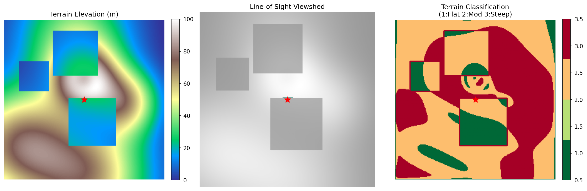

# Terrain Viewshed & Classifier
**Real-time geospatial perception pipeline for autonomous systems**

## Anduril Relevance
This project directly supports Frontier Systems' mission to "build terrain rendering systems used in live operations (viewsheds, classifications)." It demonstrates:
- **Line-of-sight computation** for operator situational awareness
- **Slope-based terrain classification** for autonomous routing
- **Hybrid C++/Python architecture** suitable for edge deployment on embedded systems

## Quick Start

### 1. Install Python Dependencies
```bash
pip install -r requirements.txt
```
### 2. Build C++ Module
```bash
mkdir build && cd build
cmake .. -DCMAKE_BUILD_TYPE=Release
make -j4
cd ..
```

### 3. Run
```bash
python main.py
```

## Output Example


**Three-panel visualization:**
1. **Left (Terrain)**: Synthetic elevation map (0–100m). Red star = observer position (15m height).
2. **Middle (Viewshed)**: Line-of-sight visibility from observer. White = visible, transparent = occluded by terrain.
3. **Right (Classification)**: Slope-based traversal classes:
   - 🟢 Green: ≤10° slope → Flat/traversable
   - 🟡 Yellow: 10–30° slope → Moderate difficulty  
   - 🔴 Red: >30° slope → Steep/obstruction

*Runtime: ~12ms for viewshed computation on 256×256 grid (C++, single-threaded, -O3).*
